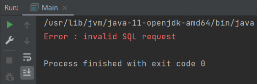
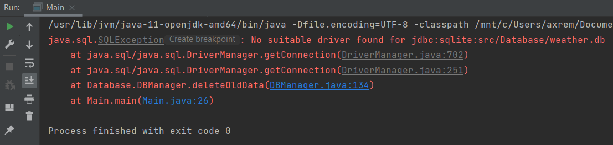

# TP9 - Rapport de sécurité

Reprise du TP6 consistant à interroger une API de météo à base d'une entrée utilisateur pour préciser la ville. Le résultat de l'API est stocké en base de données et il y a un système de cache pour ne pas conserver des données trop vielles.


Ce qui etait déja fait : 
- 


Faciles : 

Principe 0-6 / FUNDAMENTALS-6 : Encapsulate ????
Principe 0-8 / FUNDAMENTALS-8 : Secure third-party code ????
Guideline 3-2 / INJECT-2 : Avoid dynamic SQL : déja prepared statement


<br/>

## Guideline 3-1 / INJECT-1: Generate valid formatting

### Descriptif de vulnérabilité 
Le programme prend en entrée un paramètre entrée par l'utilisateur : le nom de la ville. Aucun contrôle sur le format de l'entrée n'est fait.

### Code original avec la vulnérabilité
En donnant un paramètre qui n'est pas une ville (à base de chiffres par exemple), la réponse est une erreur SQL. Il faudrait vérifier les problèmes avant pour éviter d'éventuelles injections.



Le code responsable est : 
```Java
public class Main {  
    public static void main(String[] args) {  
        String url = "jdbc:sqlite:src/Database/weather.db";
        CityWeather weather = null;  
        
        if (args.length != 1) {
            System.err.println(...);
            throw new IllegalArgumentException();
        }
  
        try {
            // Appel en base de donnée et traitement
        }
        // Gestion des exceptions
    }
}
```

*<u>Note</u> : La valeur null est gérée.*

### Version corrigée
On a ajouté une regex pour vérifier le format du nom de ville : on empêche la présence de chiffres et de caractères spéciaux, excepté le "-". Une exception est lancée si le nom entré ne correspond pas au format attendu.

```diff
public class Main {
    public static void main(String[] args) {
        String url = "jdbc:sqlite:src/Database/weather.db";
        CityWeather weather = null;
        
+        Pattern p;
+        p = Pattern.compile("[^a-zA-Z!-]"); // Regex searching for digit or special character except "-"

        try {
+            if (args.length != 1 || p.matcher(args[0]).find()) {
+                throw new IllegalArgumentException();
+            }
            // Appel en base de donnée et traitement
        }
        // Gestion des exceptions
    }
}
```

<br/>

## Guideline 2-1 / CONFIDENTIAL-1 : Purge sensitive information from exceptions
### Descriptif de vulnérabilité
Lorsqu'une ville invalide est entrée en paramètre ou qu'une autre erreur de traitement se produit (requête SQL invalide, problème de driver, etc...), une exception est affichée à l'utilisateur avec sa trace d'éxécution notamment. Cela peut donner des informations utiles à la mise en place d'une attaque par un acteur malveillant.



### Code original avec la vulnérabilité
Les exceptions sont affichées avec leur trace d'éxécution ce qui n'est pas une bonne pratique en production.

```Java
public class Main {
    public static void main(String[] args) {
        // Traitement préliminaire
        
        try {
            // Appel en base de données et traitement
        } catch (Exception e) {
            e.printStackTrace();
        }
    }
}
```

### Version corrigée
On rend la gestion des exceptions plus précise en affichant un message personnalisé pour les types d'exceptions lancées par notre programme. Ce message est assez général mais donne quand même quelques informations.

```diff
public class Main {
    public static void main(String[] args) {
        // Traitement préliminaire
        
        try {
            // Appel en base de données et traitement
+        } catch (IllegalArgumentException e) {
+            System.err.println("Usage : /usr/lib/jvm/java-11-openjdk-amd64/bin/java -Dfile.encoding=UTF-8 -classpath /mnt/c/Users/axrem/Documents/ZZ3/Java/TP6/out/production/TP6:/mnt/c/Users/axrem/Downloads/sqlite-jdbc-3.32.3.2.jar:/mnt/c/Users/axrem/Documents/ZZ3/Java/gson-2.8.8.jar Main city_name\n");
+        } catch (SQLException e){
+            System.err.println("Error : invalid SQL request");
+        } catch (ClassNotFoundException e) {
+            System.err.println("Error : invalid city entered");
+        } catch (Exception e) {
+            System.err.println("Error");
+        }
    }
}
```

Ce type de message est adapté à une utilisation en phase de développement, quand il est encore nécessaire de faire du debug et donc de comprendre les exceptions lancées. Pour la mise en production, il serait préférable de rendre le contenu des exceptions complètement opaque, en ne mettant qu'un message générique "Erreur" quel que soit le type d'exception lancée par exemple, afin de ne laisser transparaitre aucune information.


<br/>

## Guideline 1-2 / DOS-2 : Release resources in all cases
### Descriptif de vulnérabilité
Dans ce TP, il est nécessaire de manipuler des bases de données. Pour cela, il est obligatoire d'utiliser des objets Connection, ResultSet, Statement, etc... Tout ces objets doivent être fermés à la fin de leur utilisation.

### Code original avec la vulnérabilité
Quelques oublis de fermeture des ressources étaient restés dans le code. Voila un exemple de fonction de la classe DBManager où les ressources ne sont pas fermées à la fin de leur utilisation.

```Java
public static void dropTable() {
    String query = "DROP TABLE IF EXISTS weather;";

    try {
        Connection conn = DriverManager.getConnection(url);
        Statement s = conn.createStatement();
        s.execute(query);
    } catch (Exception e) {
        e.printStackTrace();
    }
}
```

### Version corrigée
```diff
public static void dropTable() throws SQLException {
    String query = "DROP TABLE IF EXISTS weather;";
    Connection conn = DriverManager.getConnection(url);
    Statement s = conn.createStatement();
    s.execute(query);

+    conn.close();
+    s.close();
}
```

*<u>Note</u> : Si les ressources ne sont pas fermées manuellement à la fin de leur utilisation, le garbage collector s'en occupera automatiquement mais c'est tout de même une bonne pratique de libérer les objets utilisés.*


<br/>

## Guideline 4-1 / EXTEND-1: Limit the accessibility of classes, interfaces, methods, and fields
### Descriptif de vulnérabilité


### Code original avec la vulnérabilité
Les champs `public static` de ce programme n'étaient jamais déclarés en `final`.

```Java
public class DBManager {
    public static String url;

    // Méthodes de la classe
}
```

### Version corrigée

```diff
public class DBManager {
+    private static String url;

    // Méthodes de la classe
}
```

<br/>

## Guideline 6-9 / MUTABLE-9: Make public static fields final
### Descriptif de vulnérabilité
Les attributs déclarés publiques et statiques non-finaux peuvent être accédés et redéfinis par les classes appelantes. Les accès et modifications ne sont alors pas contrôlées et les valeurs redéfinies ne peuvent pas être validées.


### Code original avec la vulnérabilité
Les champs `public static` de ce programme n'étaient jamais déclarés en `final`, ce qui pouvait autoriser la modification ultérieure.

```Java
public class WeatherFetcher {
    public static String api_key = "47631728a917d56bffde4b26e7e461e3";

    // Méthodes de la classe
}
```

### Version corrigée
La modification ultérieure n'est plus autorisée.

```diff
public class WeatherFetcher {
+    public static final String api_key = "47631728a917d56bffde4b26e7e461e3";

    // Méthodes de la classe
}
```

<br/>

## ATTAQUE 6
### Descriptif de vulnérabilité


### Code original avec la vulnérabilité


### Version corrigée avec corrections mises en avant


